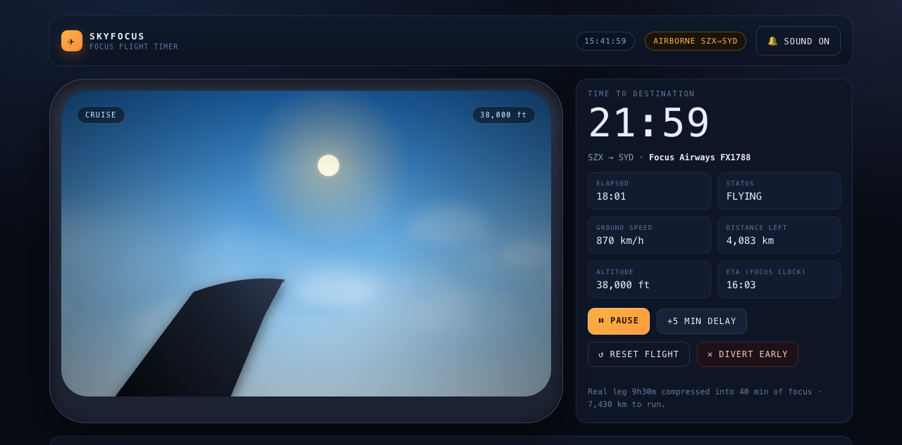
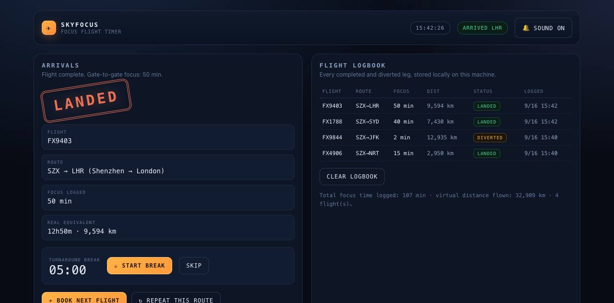

# SKYFOCUS — focus flight timer

A Pomodoro timer shaped like an airline flight. You pick a destination off a departure
board, get a boarding pass, and the app simulates the flight while it counts your focus
time down.

Single self-contained `index.html`. No build step, no dependencies, no CDN — double-click
it and it runs offline.


## What it does

**Departure board.** Origins are real airports (Shenzhen Bao'an, Hong Kong, Guangzhou
Baiyun) with real destination routes. Each row shows the real block time, the computed
great-circle distance, and the compressed focus time for that leg.

**Boarding pass.** Picking a leg generates a pass: flight number, gate, seat, boarding
time, depart/arrive times, a barcode generated from the route, and an editable passenger
name. Focus time defaults to the leg's compressed time and can be nudged ±5 minutes
before boarding.

**The flight.** A cabin-window view: sky palette that runs dawn → day → dusk → night as
the flight progresses, drifting clouds, a wing with a blinking nav light, and stars and
city lights after dark. Ground speed, altitude, distance remaining and ETA are all derived
from progress through the flight, not decorative.

**Timer features.** Start, pause/resume (the flight holds in the air), reset to the gate,
+5 min delay, divert early with partial credit, optional 5-minute turnaround break after
landing, landing chime, keyboard shortcuts (space / D / R / Esc), live countdown in the
browser tab title, and a logbook of every landed and diverted leg stored in
`localStorage`.

## Time compression

A real flight is far too long for a focus block, so the clock is compressed:

```
focus_minutes = clamp(round(real_minutes / 15), 10, 60)   # rounded to 5-min steps
```

So a 2h05 hop from Shenzhen to Hanoi becomes an 8→10 minute focus block, and the 12h50
Shenzhen–London leg becomes 50 minutes. The exact ratio for the leg is printed on the
pass (`TIME-LAPSE ×n`). Distance is never hard-coded — it comes from a haversine
calculation on the airport coordinates, and diverted flights only credit the distance
actually flown.

## Controls

| Action | Key |
|---|---|
| Pause / resume | `Space` |
| +5 min delay | `D` |
| Reset flight | `R` |
| Divert early | `Esc` |

## Screens





## How this was made

I wanted a focus timer that felt like air travel rather than a countdown wheel: choose a
destination, get a boarding pass, watch the flight actually happen, and land somewhere.
I set the requirements and the feel — the departure board, the pass with a real barcode,
the window view that changes with the time of day, the compression rule so a long-haul
leg fits one sitting — and I checked the app in the browser, caught the things that were
wrong (the in-flight route line kept showing the default route, the wing and clouds
rendered as hard blocks) and had those fixed.

Hermes Agent wrote the code: the canvas window view, the timer engine, the boarding-pass
layout, the logbook, and the test sweep. It also ran the verification in a real browser
rather than asserting the UI worked — progress sampled frame by frame while running and
while paused, the diverted-distance rule checked against 25% of a known leg length, the
caret-identity check on the passenger-name field, and a cache-busted reload to prove
`localStorage` persistence.

This one is a prototype: a single HTML file, no accounts, no server, and the flight
simulation is a stylised cabin view rather than a real map.
