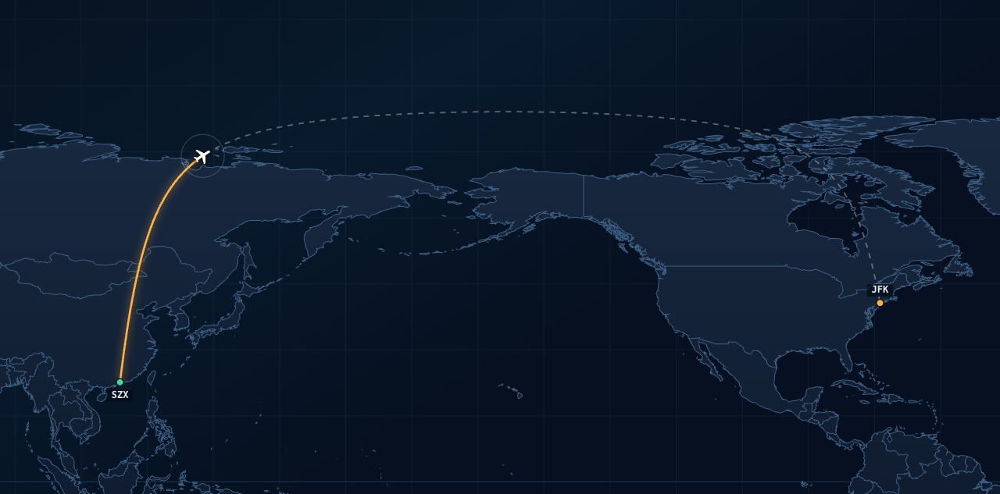
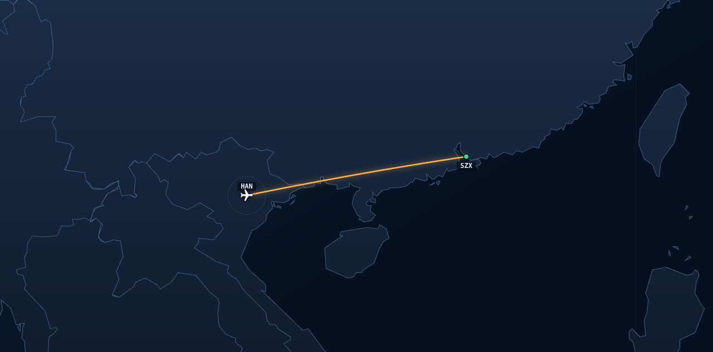

# SKYFOCUS — focus flight timer

A Pomodoro timer shaped like an airline flight. Pick a destination off a departure board,
get a boarding pass, and the app flies the real great-circle route across a world map while
it counts your focus time down — landing you at a stamped arrival pass.

One self-contained `index.html` (no build step, no dependencies, no CDN — double-click it
and it runs offline). The world map is embedded in the file, so nothing is fetched at
runtime.


## What it does

**Departure board.** Origins are real airports (Shenzhen Bao'an, Hong Kong, Guangzhou
Baiyun) with real destinations. Each row shows the real block time, the great-circle
distance computed from the airport coordinates, and the compressed focus time for that leg.

**Boarding pass.** Picking a leg generates a pass: flight number, gate, seat, boarding time,
depart/arrive times, a barcode derived from the route, and an editable passenger name. Focus
time defaults to the leg's compressed value and can be nudged ±5 minutes before boarding.

**The flight — a full-window world map.** Real Natural Earth coastlines and country borders
drawn on canvas, auto-fitted to the route, with a small white aircraft following the
great-circle track (the amber path is flown, the dashed path remains). Altitude, ground
speed, distance remaining, the nearest-airport readout and ETA are all derived from progress
through the flight. Drag to pan, wheel or the buttons to zoom, `FIT` to re-fit.

**Timer features.** Start, pause/resume (the aircraft holds), reset, +5 min delay, divert
early (partial distance credited), a 5-minute turnaround break, landing chime, keyboard
shortcuts, a live countdown in the tab title, and a logbook of every leg kept in
`localStorage`.

## Time compression

A real flight is far too long for one focus block, so the clock is compressed:

```
focus_minutes = clamp(round(real_minutes / 15), 10, 60)   # rounded to 5-minute steps
```

A 2h05 hop from Shenzhen to Hanoi becomes a 10-minute focus block; the 12h50 Shenzhen–London
leg becomes 50 minutes. The exact ratio for the leg is printed on the pass as `TIME-LAPSE ×n`.

## Controls

| Action | Key |
|---|---|
| Pause / resume | `Space` |
| +5 min delay | `D` |
| Reset flight | `R` |
| Divert early | `Esc` |
| Re-fit the map to the route | `F` |

Pan by dragging, zoom with the wheel, or use the on-map `+ / − / FIT` buttons.

## Screens






## Building

`index.html` is generated from a template plus the map data:

```bash
python3 tools/build_map_data.py   # Natural Earth 50m countries -> src/mapdata.js (~300 KB)
python3 tools/build.py            # src/template.html + mapdata -> index.html
```

`tools/build_map_data.py` downloads the TopoJSON once (cached in `/tmp`), decodes the
quantised delta arcs, simplifies each ring with Douglas-Peucker, and quantises coordinates to
0.05°. Edit `src/template.html` rather than `index.html` and re-run the build.

### Two map bugs worth knowing about

Both were found by sampling the rendered canvas rather than by looking at it:

- **Do not split rings at the antimeridian.** The source rings are whole closed "belt"
  polygons — Eurasia and Alaska are joined across the Bering Strait — that cross ±180
  through a horizontal edge. Splitting them leaves two open sub-paths, and a canvas `fill()`
  then closes each one with a straight line back to the ring's start point, painting a wide
  diagonal band across the map. Instead each ring is unwrapped into a continuous longitude
  run and clipped to the longitude band the view can show, so every cut piece closes along a
  vertical seam line outside the visible window.
- **Never cache a ring's world-copy shift.** The shift (which ±360 copy is in view) has to be
  recomputed per draw from the ring's canonical unwrapped mean. Caching the shifted geometry
  keyed on the view centre silently dropped whole countries (the UK, France, Brazil) once the
  view moved far enough to change the correct copy.

## How this was made

I wanted a focus timer that felt like air travel rather than a countdown wheel: choose a
destination, get a boarding pass, watch the flight actually cross a real map, and land
somewhere. I set the requirements and the feel — the departure board, the pass with its own
barcode, a real world map with a small white aircraft on real airline routing, and the
compression rule so a long-haul leg fits one sitting. I reviewed each build in the browser
and called out what was wrong: the progress bar's aircraft pointed the wrong way, the
cabin-window view wasn't the map I wanted, the arrival screen didn't read as a boarding
pass, and the layout wasted the window instead of filling it.

Hermes Agent wrote the code — the canvas map renderer and its clipping, the timer engine,
the boarding-pass layouts, the logbook — and it did the verification, in a real browser
rather than by assertion. That work is what turned up the two map bugs above: a longitude
pre-filter that dropped every Western-Hemisphere ring, and a cached world-copy shift that
made the UK, France and Brazil vanish. The checks included sampling the rendered canvas at
twenty known city coordinates across seven different map views (all land, no oceans), a
frame-by-frame check that the aircraft sits on its own route polyline (maximum error
0.0004 px), and a great-circle sanity test — the Shenzhen–New York midpoint comes out at
79°N, which is the polar routing real flights use, versus 32°N for a straight line on a
lat/lon grid.

This is a prototype: one HTML file, no accounts, no server, and the logbook lives in this
browser only.
