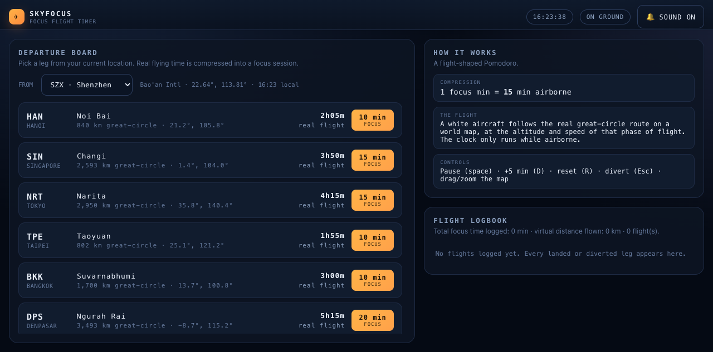
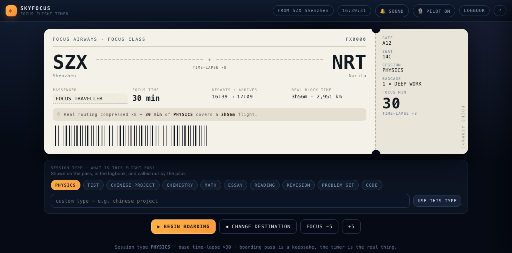
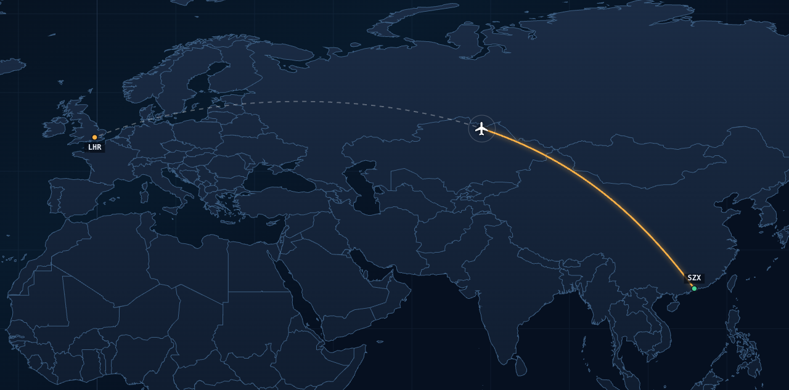
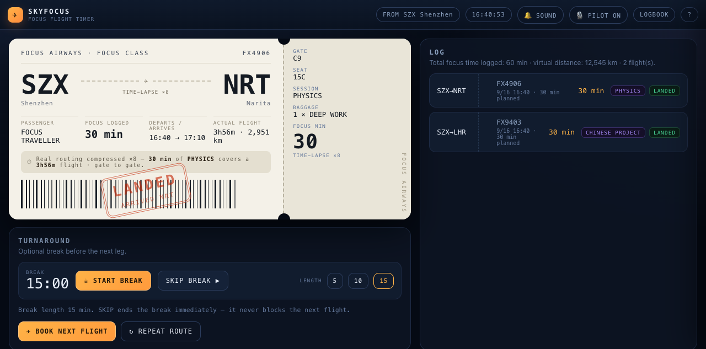

# SKYFOCUS — focus flight timer

A Pomodoro timer shaped like an airline flight. The home screen is a world map of the
airports around you with a **time scrub bar** at the bottom: set how long you want to focus,
the map shows how far the plane can get in that time, and picking a destination issues a
boarding pass. The session then runs as a flight along the real great-circle route, with a
pilot calling the phases, ending at a stamped arrival pass.

One self-contained `index.html` — no build step, no dependencies, no CDN. The world map
polygons and a 1,149-airport database are embedded, so nothing is fetched at runtime.



## The five things this build changed

1. **The break is skippable.** `SKIP BREAK ▶` ends the break immediately and never blocks the
   next flight; the countdown zeroes out, the panel turns green and the status line says you
   are clear to board. Break length is now selectable (5 / 10 / 15 min), and a completed break
   chimes and announces "ready for the next flight".
2. **Destinations are yours.** Search any of 1,149 large airports (city, code, or name), or add
   a place manually with coordinates — or click PICK FROM MAP and grab the coordinates off the
   map. Custom places are saved, drawn as markers and listed under MY ROUTES with a remove
   button. The departure airport is changeable the same way, and `◎ NEAREST AIRPORT` asks the
   browser for your position and snaps the origin to the closest field.
   "HOW IT WORKS" and "FLIGHT LOGBOOK" are off the home screen — they now live behind the `?`
   and `LOGBOOK` buttons in the top bar.
3. **The flight view follows the aircraft's nose.** The map is *heading-up*: the world turns
   so the direction of travel always points straight up the screen, with the aircraft held at
   the centre — the nose-up carriage map you get in a car, but for a great-circle track. A
   compass rose in the corner shows where north is, and the HUD reads out `TRACK` (degrees from
   north) and `VIEW`. `FIT` switches to a north-up overview of the whole route and `◎` returns
   to following.

   **The orientation survives everything you do to the window.** Clicking, double-clicking,
   scrolling to zoom and resizing the window all leave the view heading-up and centred: the
   pointer only counts as a drag after 6 px of travel, wheel zoom is a zoom rather than a
   reason to stop following, and a resize re-snaps the camera instead of loosening it. A real
   drag does hand control over — but it pans *within* the heading-up frame (`VIEW: PANNED`,
   aircraft off-centre, nose still up), so the map is never yanked back to north-up. That last
   part was a genuine bug: a one-pixel click used to drop out of follow mode and snap the
   rotation to north.

   **Pilot.** Two call-outs per flight, at departure and landing only — everything else is
   silent (no chatter while cruising, pausing or on a break). Each is a real PA pattern: the
   cabin chime, one line, a beat, then the second line. Departure: "Cabin crew, doors for
   departure." … "Welcome aboard Focus Airways, flight 9 4 0 3, service to London. Today's
   session is 30 minutes of physics. Please stow your distractions, and enjoy the flight."
   Landing: "Ladies and gentlemen, we have just landed at London." … "Thank you for flying with
   us. That was 30 minutes of physics logged. Local time is 4:40 PM." The voice is chosen from
   the system's natural voices by name (Samantha, Serena, Karen, Google/Microsoft voices…)
   rather than the default, spoken at 0.95 rate and normal pitch, and the flight number is
   spoken digit by digit. If speech synthesis is unavailable it falls back to the chime; the
   chime can be muted separately from the voice. The progress bar under the flight keeps its own
   aircraft pointing along the direction of travel.

   **Smoothness.** The camera eases toward its target (position, zoom and rotation, exponential
   approach) instead of jumping, so switching between follow, overview and manual glides rather
   than cuts. The world is rasterised once into a large cached square base and then blitted with
   rotation and translation each frame, tolerating a ±35% scale difference, so easing a zoom
   costs *no* re-render at all; a fresh base is only drawn when the aircraft drifts 6% across it
   or the zoom settles far from the cached scale. Measured in Chrome: **median frame interval
   16.7 ms, p95 16.9, max 17.5** with wheel-zoom hammered continuously, a base render costs
   0.8–2.8 ms, and a whole flight needs about eight of them. The progress-bar aircraft is driven
   every frame rather than by a CSS transition, and the home map's auto-fit is debounced while
   the time slider is being dragged.
4. **The home screen is a map plus a time bar.** It opens framed on your neighbourhood — your
   airport, the nearest legs, and an amber range ring showing how far the current session
   length reaches (the ring grows as you drag the time slider). Destinations inside the ring
   are solid; beyond it they are dimmed. Default time-lapse is now **×30** (1 focus minute =
   30 airborne minutes), so a 30-minute session reaches ~12,000 km.
5. **Session types.** The boarding pass has a SESSION TYPE row — presets (PHYSICS, TEST,
   CHINESE PROJECT, …) plus any custom text you type, kept as recent chips. The type is printed
   on the pass and its stub, shown in the flight HUD, carried into every logbook entry, and
   spoken by the pilot ("a 30 minute CHINESE PROJECT session").

## Time compression

```
focus_minutes = clamp(round(real_minutes / time_lapse), 10, 120)   # 5-minute steps
real_minutes  = 25 + km/840*60 + (km < 1200 ? 20 : 0)              # modelled block time
reach_km      = (focus_minutes * time_lapse - overhead) / 60 * 840
```

Real block times are modelled from the great-circle distance rather than hand-listed, so any
airport in the database can be a destination. The exact ratio for the chosen leg is printed on
the pass as `TIME-LAPSE ×n`.

## Controls

| Action | Key |
|---|---|
| Pause / resume | `Space` |
| +5 min delay | `D` |
| Reset flight | `R` |
| Divert early | `Esc` |
| Re-fit the map | `F` |

Drag to pan, wheel to zoom, `＋ / − / FIT` on the map. `LOGBOOK` and `?` open the side drawer.

## Screens





## Camera model

| Mode | Behaviour |
|---|---|
| `FOLLOW` (default) | centred on the aircraft, rotated so its track points up |
| `OVERVIEW` (`FIT`) | north up, whole route framed |
| `PANNED` (drag) | free pan, still rotated so the track points up |

Wheel zoom keeps you in `FOLLOW`; clicks and window resizes cannot knock the view out of it.

The rotation is computed from the aircraft's own projected direction of travel, so "up" on the
screen is the projected track — checked in the browser at several points along a flight: the
track deviates from straight up by **0.01–0.03°**, with the aircraft **0.1 px** off centre.

## Building

`index.html` is generated from a template plus two data files:

```bash
python3 tools/build_map_data.py   # Natural Earth 50m countries -> src/mapdata.js (~300 KB)
python3 tools/build_airports.py   # OurAirports large airports   -> src/airports.js  (~75 KB)
python3 tools/build.py            # template + both data files   -> index.html
```

Both data scripts download once and cache into `/tmp`; both simplify/filter before embedding.
Edit `src/template.html`, never `index.html`, then re-run `tools/build.py`.

### Map bugs worth knowing about

Found by sampling the rendered canvas rather than by looking at it:

- **Do not split rings at the antimeridian.** The source rings are whole closed "belt"
  polygons — Eurasia and Alaska are joined across the Bering Strait — that cross ±180 through
  a horizontal edge. Splitting them leaves open sub-paths, and `fill()` then closes each one
  with a straight line back to the ring's start point, painting a wide diagonal band across
  the map. Instead each ring is unwrapped into a continuous longitude run and clipped to the
  longitude band the view can show.
- **Fill from country polygons, not from the `land` object.** That globe-wrapping belt makes
  the interior of a cut piece ambiguous, and the fill spilled a band across the Pacific.
- **Never cache a ring's world-copy shift.** The ±360 shift has to be recomputed per draw from
  the ring's canonical unwrapped mean; caching it against the view centre silently dropped
  whole countries (the UK, France, Brazil) once the view moved.
- **A longitude pre-filter on raw longitudes drops the Western Hemisphere**, because a ring at
  −74° is really in view at +286°. Let the clipper decide longitude.
- **A rotated map needs a bigger base than the viewport.** A square base of side `1.08 ×
  diagonal` looks sufficient and is not: once rotated, the corners of the viewport fall outside
  it and you get black wedges. The base is `1.25 × diagonal`, which covers `hypot(W/2,H/2)` plus
  the drift allowance at every angle — verified by sampling all four corners at seven headings
  across a flight (zero black pixels).

## How this was made

I wanted a focus timer that felt like air travel rather than a countdown wheel. I set the
requirements and the feel, and after using the first build I called out what was wrong: the
break could not be skipped, the destinations were fixed and the home page was cluttered, the
aircraft pointed along the route instead of up, the timer had no purpose attached to it, and
the home screen should be a map of nearby places with a time bar rather than a list.

Hermes Agent wrote the code and did the verification in a real browser. That work is what
caught the map bugs above and the rest of the list: the aircraft on the progress bar pointed
down, the in-flight route line kept the default route, the arrival stamp covered the very
details it was stamping, and my first publish script sent parentless commits so update pushes
produced a divergent SHA. The checks included sampling the rendered canvas at twenty known
city coordinates across seven map views (all land, zero oceans), frame-by-frame checks that
the aircraft sits on its own route polyline (max error 0.0013 px) and that a session's
progress is monotonic while flying and frozen while paused, a great-circle sanity test
(Shenzhen–New York midpoint at 79°N — the polar routing real flights use — versus 32°N for a
straight line on a lat/lon grid), a caret-identity check on the passenger-name field, a guard
test that typing `d` or space inside the session-type box cannot touch the timer, and a
cache-busted reload proving customs places, session type and settings persist. Zero console
errors.

This is a prototype: one HTML file, no accounts, no server, logbook and custom places live in
this browser only. The pilot voice uses the browser's own speech synthesis.
